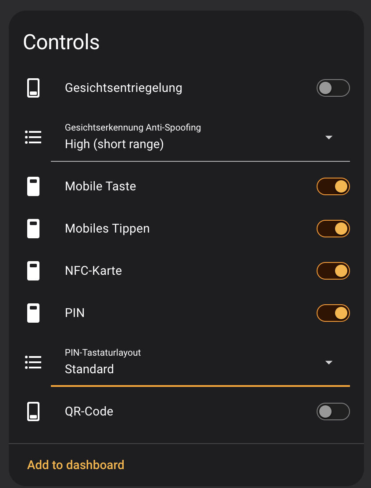
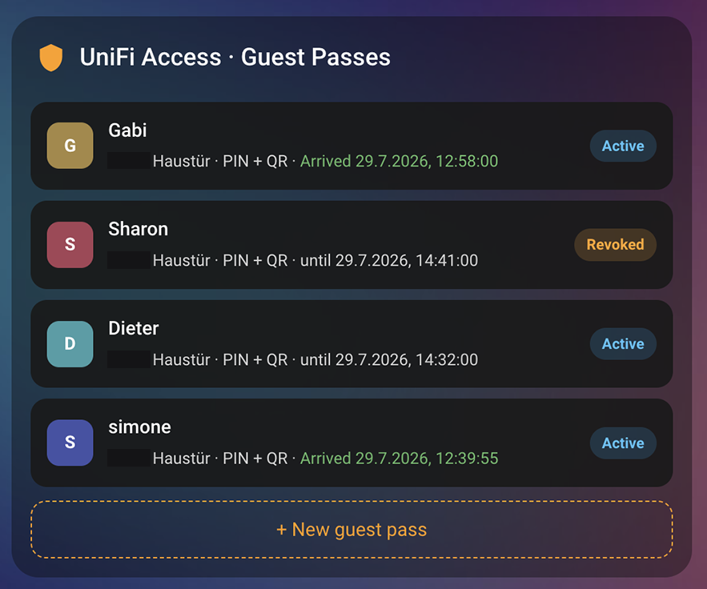
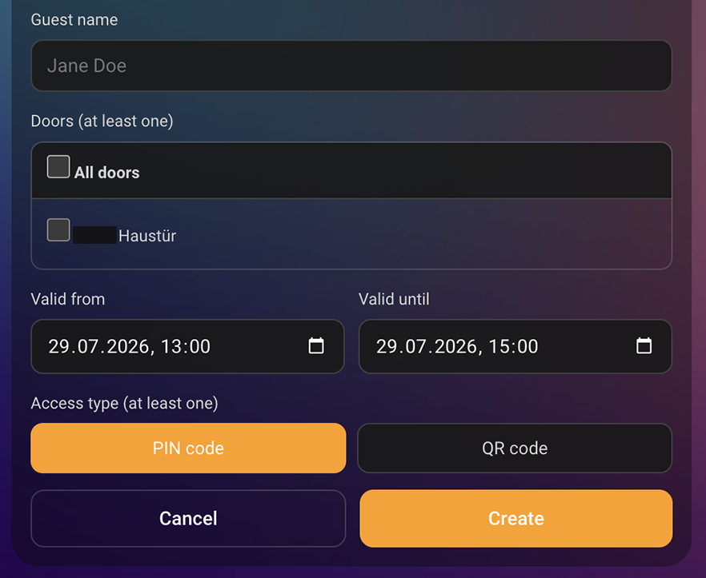
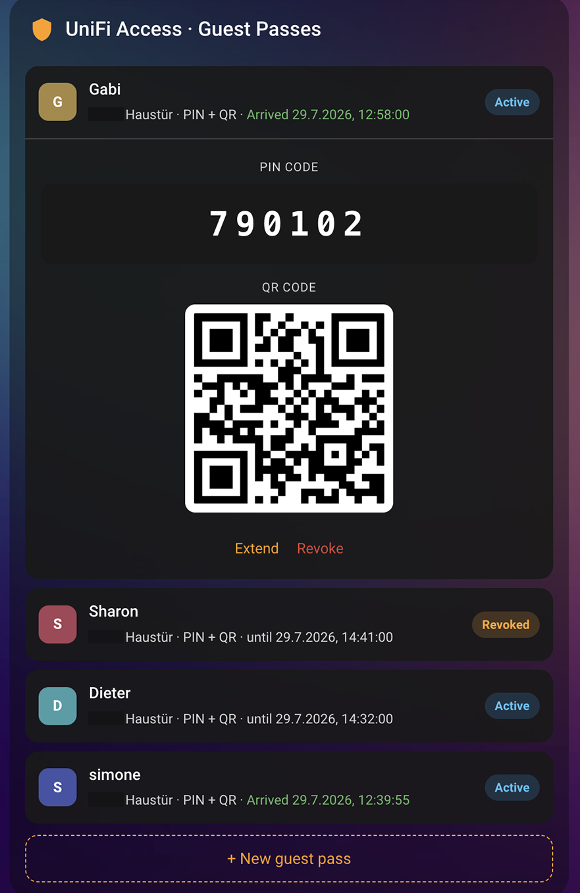
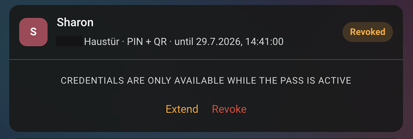
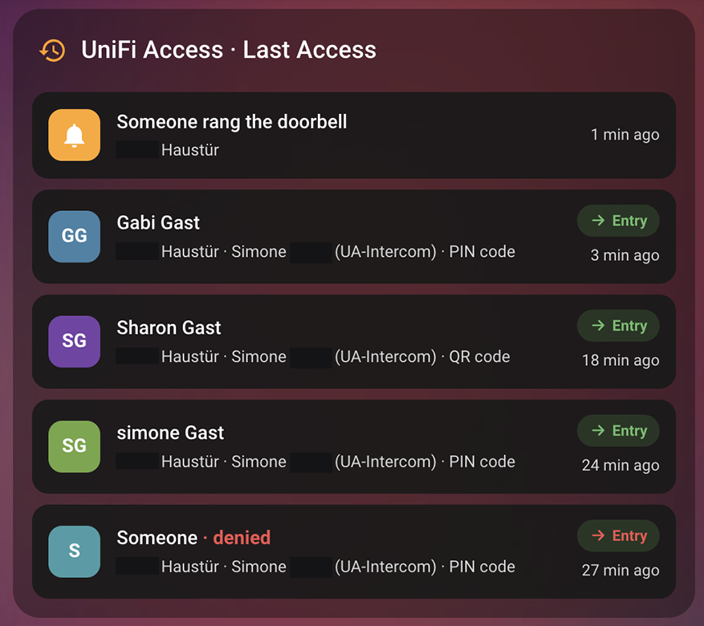
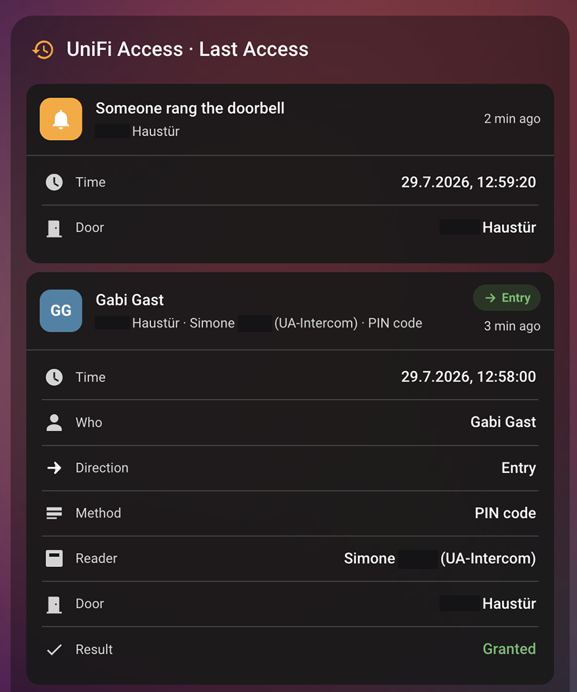

# Unifi Access Custom Integration for Home Assistant

> This is a fork of [imhotep/hass-unifi-access](https://github.com/imhotep/hass-unifi-access) (Apache License 2.0) with additional features, including per-reader access-method controls, time-limited guest passes with a bundled Lovelace card, and a "last access" sensor and card.

- This is a basic integration of [Unifi Access](https://ui.com/door-access) in [Home Assistant](https://homeassistant.io). 
- If you have Unifi Access set up with UID this will likely *NOT* work although some people have reported success using the free version of UID. 
- _Camera Feeds are currently not offered by the API and therefore **NOT** supported_.

# ✨ Advanced features

This is the **advanced** edition of the integration. In addition to doors, locks and events, it exposes controls and dashboards that the core and upstream integrations do not:

- **🔘 Per-reader access-method switches** — turn each unlock method on or off per reader, straight from Home Assistant (automations or dashboard): **Face Unlock**, **NFC Card**, **PIN**, **QR Code**, **Mobile Button**, **Mobile Tap**, **Hand Wave** and **Touch Pass**. Only the methods a device actually supports are shown.
- **🎚️ Face Anti-Spoofing** and **PIN Keypad Layout** selects — tune the Face Unlock security level and switch the PIN pad between standard and randomized layout.
- **🎟️ Time-limited guest passes** — create, extend and revoke visitor **PIN / QR** passes (single or multi-door) from Home Assistant, with a **bundled Lovelace card** that shows the PIN and QR code while the pass is active.
- **🕓 "Last Access" sensor + Lovelace card** — see who entered/left which door, with which method, and when, merged across all doors.
- **🚪 Garage door / gate mode (UGT)** — expose a UGT door as a `cover` (garage door or gate) instead of a lock, switchable per door.

Both dashboard cards are **bundled and auto-registered** (no manual Lovelace resource setup) and ship with built-in translations (`de`, `en`, `it`, `nl`, `zh-Hans`). Jump to [Access method controls](#access-method-controls-nfc-face-unlock-pin-qr-), [Guest passes](#guest-passes) and [Last Access](#last-access) for details.

## Core integration vs. this HACS integration

Home Assistant now includes a core UniFi Access integration. For most users, the core integration is the recommended starting point.

The core integration has met Home Assistant's Platinum quality requirements and any changes to it are reviewed by Home Assistant core maintainers. This provides stronger long-term stability, consistency with Home Assistant architecture, and better alignment with the Home Assistant entity model.

This HACS integration will continue to be maintained for the foreseeable future. It exists for users who prefer its current behavior, need features that are not yet available in core, or want functionality that does not fit easily into the architectural rules required for Home Assistant core integrations.

In short:

Use the core integration if you want the most official, reviewed, and Home Assistant-native experience.
Use this HACS integration if you specifically need one of the differences listed below.

Current differences
The core integration uses button entities/actions for door operations. This follows Home Assistant's entity model more strictly, especially because the UniFi Access API does not currently support locking doors.
This HACS integration exposes doors as lock entities for convenience. You can unlock/open a door, but locking is unsupported by the UniFi Access API and will only log a warning.
The core integration supports auto-discovery. This HACS integration does not.
The core integration may require additional Home Assistant helpers/templates or automations for some workflows that this HACS integration exposes more directly.
This HACS integration exposes **per-reader access-method switches** (Face Unlock, NFC, PIN, QR, mobile, hand wave, touch pass) and Face-Anti-Spoofing / PIN-Keypad-Layout selects that are not available in core.
This HACS integration adds **time-limited guest passes** and a **"Last Access"** sensor, each with a bundled Lovelace dashboard card.

# Supported hardware
- Unifi Access Hub (UAH) :white_check_mark:
- Unifi Access Hub (UAH-DOOR) :white_check_mark:
- Unifi Access Intercom (UA-Intercom) :white_check_mark:
- Unifi Access G3 Intercom (UA-G3-Intercom) :white_check_mark:
- Unifi Access Hub Enterprise (UAH-Ent) :white_check_mark:
- Unifi Gate Hub (UGT) :white_check_mark:
- Unifi Access Ultra (UA-Ultra) :white_check_mark:
- Unifi Access Door Mini (UA-Hub-Door-Mini) :white_check_mark:

# Getting Unifi Access API Token
- Go to http(s)://{unifi_access_console}/access/settings/system
- Create a new token and pick all permissions (this is *IMPORTANT*). At the very least pick: Space, Device and System Log.

# Installation (HACS)
- You can just add this integration to HACS by searching for Unifi Access. If you can't find it, follow the steps below.

- Add this repository as a custom repository in HACS and install the integration.
- Restart Home Assistant
- Add new Integration -> Unifi Access
- Enter your Unifi Access controller IP or Hostname (default is `unifi` or `UDMPRO`). No need to enter port or scheme
- Enter your API Token that you generated in Unifi Access
- Select `Verify SSL certificate` only if you have a valid SSL certificate. For example: If your Unifi Access API server is behind a reverse proxy. Selecting this will fail otherwise.
- Select `Use polling` if your Unifi Access version is < 1.90. Default is to use websockets for instantaneous updates and more features.
- It should find all of your doors and add the following entities for each one
    - Door Position Sensor (binary_sensor). If you don't have one connected, it will always be **off** (closed).
    - Doorbell Pressed (binary_sensor). Requires **Unifi Access Reader Pro G1/G2** otherwise always **off**. Only appears when **Use polling** is not selected!
    - Door Lock (lock). You can unlock or open a door, but locking is unsupported and only logs a warning.
    - Event entities (`event`): Door Event and Doorbell Press. These are only created when `Use polling` is not selected.
    - `Last Access` sensor (websocket mode) — see [Last Access](#last-access).
    - Per-reader **access-method switches and selects** (Face Unlock, NFC, PIN, QR, …) — see [Access method controls](#access-method-controls-nfc-face-unlock-pin-qr-).
- **Guest pass** actions and the two **bundled dashboard cards** are also available — see [✨ Advanced features](#-advanced-features).


# Installation (manual)
- Clone this repository
- Copy the `custom_components/unifi_access` to your `config/custom_components` folder in Home Assistant.
- Restart Home Assistant
- Add new Integration -> Unifi Access
- Enter your Unifi Access controller IP or Hostname (default is `unifi` or `UDMPRO`). No need to enter port
- Enter your API Token that you generated in Unifi Access
- Select `Verify SSL certificate` only if you have a valid SSL certificate. For example: If your Unifi Access API server is behind a reverse proxy. Selecting this will fail otherwise.
- Select `Use polling` if your Unifi Access version is < 1.90. Default is to use websockets for instantaneous updates and more features.
- It should find all of your doors and add the following entities for each one
    - Door Position Sensor (binary_sensor). If you don't have one connected, it will always be **off** (closed).
    - Doorbell Pressed (binary_sensor). Requires **Unifi Access Reader Pro G1/G2** otherwise always **off**. Only appears when **Use polling** is not selected!
    - Door Lock (lock). You can unlock or open a door, but locking is unsupported and only logs a warning.
    - Event entities (`event`): Door Event and Doorbell Press. These are only created when `Use polling` is not selected.
    - `Last Access` sensor (websocket mode) — see [Last Access](#last-access).
    - Per-reader **access-method switches and selects** (Face Unlock, NFC, PIN, QR, …) — see [Access method controls](#access-method-controls-nfc-face-unlock-pin-qr-).
- **Guest pass** actions and the two **bundled dashboard cards** are also available — see [✨ Advanced features](#-advanced-features).

# Events
When websocket mode is enabled (`Use polling` is **not** selected), this integration creates two Home Assistant `event` entities for each door:

- `Door Event`
- `Doorbell Press`

## Doorbell Press
One `Doorbell Press` entity is created per door. It updates when the integration receives a doorbell start or stop event.

### Event types
- `unifi_access_doorbell_start`
- `unifi_access_doorbell_stop`

### Event metadata
- `door_name`
- `door_id`
- `type`

For hardware doorbells, the integration may emit `unifi_access_doorbell_stop` automatically after a short delay if no explicit stop event is received.

## Door Event
One `Door Event` entity is created per door. It updates whenever the integration receives an access event for that door.

### Event types
- `unifi_access_entry`
- `unifi_access_exit`
- `unifi_access_access` (generic access event when the controller does not provide a clear entry/exit direction)

### Event metadata
- `door_name`
- `door_id`
- `actor` # the user tied to the event, when available
- `authentication` # authentication source reported by the controller
- `method` # opened method, when provided by the controller
- `type`
- `result` # examples: `ACCESS`, `BLOCKED`, `INCOMPLETE`

#### Warning regarding Door Events
Door events are using an undocumented API. Sadly, in September 2025, the Unifi Access API introduced some bugs that we have worked around but these events are still not 100% reliable depending on your hub. I recommend using the [Alarm Manager webhooks](https://github.com/imhotep/hass-unifi-access/issues/185#issuecomment-3895814140) if you need a more reliable way to automate based on door events.

### Evacuation/Lockdown
The evacuation (unlock all doors) and lockdown (lock all doors) switches apply to all doors and gates and **will sound the alarm** no matter which configuration you currently have in your terminal settings. The status will not update currently (known issue).

### Thumbnail 
A thumbnail of when the door is last accessed/locked/unlocked.

### Door lock rules (only applies to UAH)
The following entities will be created: `input_select`, `input_number` and 2 `sensor` entities (end time and current rule).
You are able to select one of the following rules via the `input_select`:
- **keep_lock**: door is locked indefinitely
- **keep_unlock**: door is unlocked indefinitely
- **custom**: door is unlocked for a given interval (use the input_number to define how long. Default is 10 minutes).
- **reset**: clear all lock rules
- **lock_early**: locks the door if it's currently on an unlock schedule.
- **lock_now**: locks the door if it's currently on an unlock schedule OR if it's unlocked temporarily via a locking rule.

# Access method controls (NFC, Face Unlock, PIN, QR, …)

For every reader / intercom the controller reports, this integration creates entities to enable or disable each unlock method directly from Home Assistant — no need to open the UniFi Access app. Only the methods a device actually supports are created.

**Switches** (per reader):

| Entity | Method |
| --- | --- |
| `Face Unlock` | Biometric face unlock |
| `NFC Card` | NFC / UA card |
| `PIN` | PIN code on the keypad |
| `QR Code` | QR code |
| `Mobile Button` | UniFi Identity app button |
| `Mobile Tap` | Bluetooth tap-to-unlock |
| `Hand Wave` | Wave-to-unlock gesture |
| `Touch Pass` | Apple/Google wallet pass |

**Selects** (per reader):

- `Face Anti-Spoofing` — mirrors the Face Unlock security slider: `Off (long range)`, `Off (medium range)`, `Medium (short range)`, `High (short range)`.
- `PIN Keypad Layout` — `Standard` or `Randomized` (shuffled keypad).

Requirements: UniFi Access **3.3.10 or later**, websocket mode (i.e. `Use polling` **not** selected). Changes made in the UniFi Access app are picked up automatically.



*Per-reader controls: Face Unlock, Anti-Spoofing level, Mobile Button/Tap, NFC, PIN, PIN keypad layout and QR code.*

### Example: disable Face Unlock at night

```yaml
alias: Disable Face Unlock at night
triggers:
  - platform: time
    at: "22:00:00"
actions:
  - action: switch.turn_off
    target:
      entity_id: switch.front_door_face_unlock
mode: single
```

# Guest passes

Create time-limited visitor passes (PIN and/or QR) from Home Assistant without sharing your main credentials. Passes can cover a single door or several doors, and can be extended or revoked at any time.



*The guest pass card: each pass shows its doors, credential types, validity or arrival time, and status.*

**Actions** (domain `unifi_access`):

- `create_guest_pass` — `name`, `door_id` (one id or a list), `valid_from`, `valid_until`, `credentials` (`pin`, `qr` or both). Returns the generated **PIN in plaintext** and/or the **QR code image**.
- `extend_guest_pass` — `visitor_id`, `valid_from`, `valid_until` (reactivate / prolong an existing pass, keeping its PIN/QR).
- `revoke_guest_pass` — `visitor_id`.
- `list_guest_passes` — returns the available doors and all passes.

### Bundled Lovelace card

Add the card `custom:unifi-access-guest-card` to a dashboard to create, view, extend and revoke passes from a UI. It shows the **PIN and QR code while a pass is active**, offers a multi-door checklist, and updates itself when a guest arrives.

```yaml
type: custom:unifi-access-guest-card
```

<p>
  
  
</p>

*Left: the create form (name, doors, validity window, PIN/QR). Right: an active pass expanded to show its PIN and QR code.*



*Tap a pass to extend or revoke it; credentials are hidden once a pass is no longer active.*

Requirements: API token with `edit:visitor` + `view:credential` permissions; QR passes need UniFi Access **3.3.10 or later**.

### Example: create a 3-hour PIN pass

```yaml
action: unifi_access.create_guest_pass
data:
  name: Cleaner
  door_id: <your_door_id>
  valid_from: "{{ now() }}"
  valid_until: "{{ now() + timedelta(hours=3) }}"
  credentials: [pin]
```

# Last Access

For each door (websocket mode only) a `Last Access` sensor exposes the most recent access: the timestamp as its state, plus `actor`, `method`, `direction`, `result` and `reader` attributes, and a rolling `events` history of the most recent accesses.

### Bundled Lovelace card

Add `custom:unifi-access-last-access-card` to a dashboard to see recent accesses across all doors — who, direction, method, reader and time — with an expandable detail view. Doorbell rings appear as their own entries.

```yaml
type: custom:unifi-access-last-access-card
max_logs: 5          # number of entries to show (default 5)
# entities:          # optional — restrict to specific last-access sensors
#   - sensor.front_door_last_access
```

<p>
  
  
</p>

*Left: recent accesses across all doors, including doorbell rings and denied attempts. Right: an entry expanded to show time, person, direction, method, reader, door and result.*

# Garage door / gate (UGT)

A **UGT** (Unifi Gate Hub) door can be modeled as a `cover` instead of a lock. An `Entity Type` select is created for UGT doors with the options `Lock (Door)` (default), `Garage Door` and `Gate`.

Switching to `Garage Door` or `Gate` replaces the lock entity with:

- a `cover` entity (open / close / stop),
- `Opening Timeout` and `Closing Timeout` number helpers (used to infer travel state and expose an `obstruction_detected` attribute),
- a `Clear Obstruction` button.

The change is applied in place without reloading the whole integration.

# Example automations

## Unlock door

```yaml
alias: Unlock Front Gate when motion is detected in Entryway
description: ""
trigger:
  - platform: state
    entity_id:
      - binary_sensor.entryway_motion_detected
condition: []
action:
  - service: lock.unlock
    data: {}
    target:
      device_id: xxxxxxxxxxxxxxxxxxxxxxxxxxxxxxx
mode: single
```

## Use event as automation trigger

Listen to Unifi Access events and use the event data to send a notification whenever someone accesses a door.

```yaml
alias: Announce person having opened a Unifi door
description: ""
triggers:
  - platform: event
    event_type: 
      - unifi_access_entry
      - unifi_access_access
variables:
  actor: "{{ trigger.event.data.actor or 'Unknown' }}"
  door_name: "{{ trigger.event.data.door_name or 'Unknown' }}"
actions:
  - action: notify.mobile_app_my_phone
    data:
      title: Door opened
      message: "{{ actor }} has opened {{ door_name }}."
mode: single
```
# API Limitations
The Unifi Access API does *NOT* support door locking at the moment. You probably already have it set to automatically lock after a small delay anyway.

# Removing the integration
1. Go to **Settings → Devices & Services → Unifi Access**
2. Click on the three-dot menu (⋮) on the integration card
3. Select **Delete**
4. Restart Home Assistant
5. If you installed via HACS you can also uninstall the repository from HACS afterwards

# Wishlist
- door code via service

# Troubleshooting

## Invalid API Key 

You have likely created a Unifi Protect token and you need to create a Unifi Access token

Please create an issue if you have a feature request and pull requests are always welcome!

# Support my work
[](https://www.buymeacoffee.com/aniskadri)
